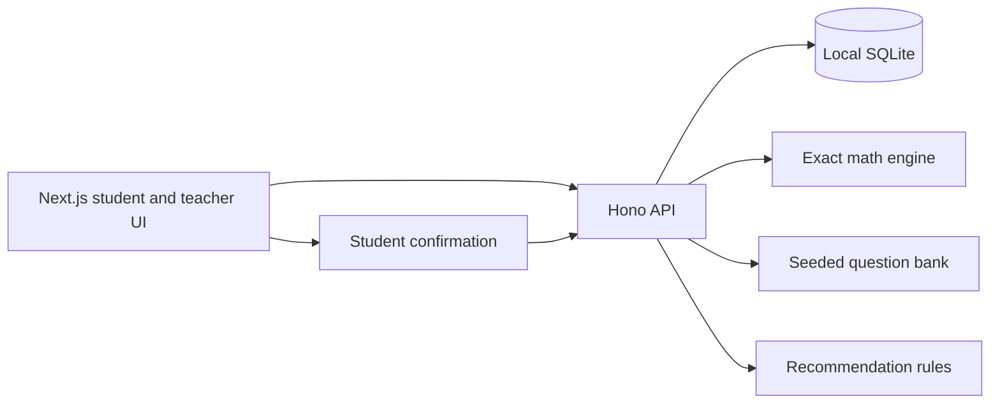

# System Architecture

The implemented modular monolith runs Next.js with a Hono API and a local SQLite adapter. Pure packages own contracts, question generation, exact mathematics, recommendations, and vision-output validation. Cloud adapters are not wired.

The server is authoritative for permissions, transcription versions, and grading. See [[ADR-0001-System-Architecture]].

Related: [[00-START-HERE]] · [[Current-State]]
